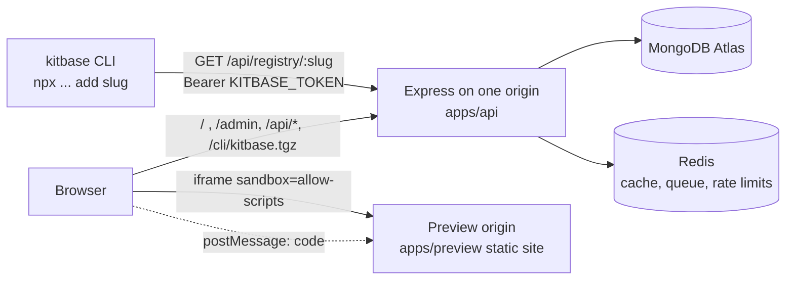

# Kitbase codebase guide (interview prep)

Kitbase is my answer to the Tech Inject assignment "Design Theme Library".
It is a CRM-themed React + TypeScript component library with:

- a public catalogue (browse, live preview, copy code, `npx` install, AI-agent prompt),
- an admin panel (upload, publish, free/premium switch, grant/revoke premium),
- premium access that the server checks on every request,
- a `kitbase` CLI that installs components into any React project.

Stack: MERN + TypeScript (strict) + Tailwind CSS v4.
MongoDB (Mongoose), Express 5, React 19 with Vite, Node 22.
Redis is optional. Without it, cache, queue and rate limits fall back to memory.

The repo is an **npm workspaces monorepo run by Turborepo**. npm workspaces link the packages; Turborepo (`turbo.json`) runs `build`, `typecheck` and `dev` across them in dependency order and caches results, so unchanged packages are skipped.
That means one repo, one `package-lock.json`, many small packages that import each other by name (for example `@ti/core`).
Root `package.json` lists the workspaces: `packages/*`, `apps/*`, `plugins/*`.

---

## 1. Folder structure

```
tech-inject/
  apps/
    api/        Express server
    web/        public catalogue (React)
    admin/      admin panel (React)
    preview/    sandboxed preview renderer (React, separate origin)
  packages/
    core/       pure business rules
    ui/         the CRM theme + 26 components
    client/     shared React pieces for web and admin
    cli/        the `kitbase` installer
    redis/      one shared Redis connection
    cache/      tiny JSON cache
    queue/      background jobs
    rate-limit/ request limiters
  plugins/
    feature-radar/  feature requests + AI draft builder
  examples/
    consumer-cli/   test app built only from `npx ... add`
    consumer-copy/  test app built only from "Copy code"
    consumer-agent/ test app built only from the agent prompt
    demo-bundles/   sample bundle for the admin upload demo
  scripts/      screenshot and check helpers (.mjs)
  docs/         reference captures, bundle format, comparison
  render.yaml   Render deployment blueprint
```

One line each: what it is, and why it exists.

| Folder                  | What                                                                                       | Why                                                                            |
| ----------------------- | ------------------------------------------------------------------------------------------ | ------------------------------------------------------------------------------ |
| `apps/api`              | Express API. In production it also serves the built catalogue (`/`) and admin (`/admin`).  | One origin means cookies are same-site. No CORS for the main app.              |
| `apps/web`              | Public catalogue. Landing page, docs layout, light/dark theme, account page.               | What visitors and customers use.                                               |
| `apps/admin`            | Admin dashboard: Overview, Components, Editor, Privileges, Feature radar.                  | Lets the admin publish without a redeploy.                                     |
| `apps/preview`          | Tiny page that compiles and renders component code in the browser.                         | Untrusted code must run on a different origin from the main site. See flow 3b. |
| `packages/core`         | Pure functions: bundle schema + validation, `decideAccess`, registry/copy/prompt builders. | No Express, no DB. Easy to unit test. One source of truth for rules.           |
| `packages/ui`           | CRM theme tokens, 26 components, examples, registry manifests.                             | The actual product. Also the free seed data.                                   |
| `packages/client`       | `PreviewFrame`, `CopyButton`, `CodeBlock`, `api()` helper.                                 | Web and admin both need them. Write once.                                      |
| `packages/cli`          | Zero-dependency installer, served as `/cli/kitbase.tgz`.                                   | `npx <url>/cli/kitbase.tgz add button` works with no npm publish.              |
| `packages/redis`        | One shared ioredis connection from `REDIS_URL` (null when unset).                          | Every Redis user shares one connection.                                        |
| `packages/cache`        | JSON cache: Redis, or an in-memory Map with TTL.                                           | Catalogue reads are fast. Same interface with or without Redis.                |
| `packages/queue`        | Background jobs: BullMQ on Redis, or in-process.                                           | Big bundle uploads are validated off the request.                              |
| `packages/rate-limit`   | Sliding-window and token-bucket limiters + Express middleware (429 + `Retry-After`).       | Protects login and the registry endpoint from abuse.                           |
| `plugins/feature-radar` | Search-driven feature requests and an AI draft builder, with its own model, routes, UI.    | Extra feature kept outside the core app, so it can be removed cleanly.         |
| `examples/consumer-*`   | Clean Vite apps built from each delivery channel.                                          | Proof that copy, CLI and agent prompt really produce working code.             |
| `examples/demo-bundles` | `pipeline-health` bundle used in the admin demo.                                           | A ready file to upload during a live demo.                                     |
| `scripts`               | Headless Chrome helpers.                                                                   | Reference capture, screenshots, preview health check.                          |
| `docs`                  | Reference screenshots, tokens, component inventory, comparison, `bundle-format.md`.        | Evidence and the upload format spec.                                           |

Jargon, once:

- **Bundle**: a JSON file with a component's source files, examples, dependencies and free/premium flag.
- **Registry item**: the shadcn-style JSON the CLI downloads (files + dependencies).
- **Origin**: scheme + host + port. Browsers isolate cookies and storage per origin.

---

## 2. What `.mjs` means, and every script

A `.mjs` file is JavaScript written as an **ES module**.
It uses `import` / `export` instead of `require`.
Node runs it directly: `node file.mjs`. No TypeScript, no build step.

A plain `.js` file is also an ES module when the nearest `package.json` has `"type": "module"`.
The root `package.json` has that, so `.js` files here (like `packages/cli/build.js`) are ESM too.
`.mjs` just makes it explicit, whatever the package says.

| Script                             | Purpose                                                                                                                                | How to run                                                     |
| ---------------------------------- | -------------------------------------------------------------------------------------------------------------------------------------- | -------------------------------------------------------------- |
| `scripts/capture-crm.mjs`          | Screenshots the reference Sales CRM through Chrome DevTools Protocol. Output: `docs/reference/screens/`.                               | `node scripts/capture-crm.mjs`                                 |
| `scripts/shot.mjs`                 | Headless Chrome screenshot of one local page. Optional cookie and "click text" steps.                                                  | `node scripts/shot.mjs out.png <url> [w] [h] [--click "Text"]` |
| `scripts/admin-shots.mjs`          | Screenshots many admin pages in one logged-in session (avoids the login rate limit). Reads admin creds from `.env`, never prints them. | `node scripts/admin-shots.mjs <outDir> <w> <h> <path>...`      |
| `scripts/check-previews.mjs`       | Opens every published component as the premium test user, clicks every example, reports broken previews.                               | `node scripts/check-previews.mjs [origin]`                     |
| `scripts/side-by-side.mjs`         | Builds `docs/comparison/side-by-side/<slug>.png`: reference next to our version.                                                       | `node scripts/side-by-side.mjs`                                |
| `examples/consumer-copy/paste.mjs` | Simulates a user pasting "Copy code": fetches `/api/components/<slug>/copy`, splits on file markers, writes files.                     | `node examples/consumer-copy/paste.mjs <slug>` (API on :4000)  |
| `examples/demo-bundles/build.mjs`  | Builds `pipeline-health.json` from the `.tsx` source, ready to upload in the admin.                                                    | `node examples/demo-bundles/build.mjs`                         |
| `packages/cli/build.js`            | Packs the CLI into `packages/cli/dist/kitbase.tgz` with the API origin (`PUBLIC_ORIGIN`) baked in.                                     | `npm run build -w packages/cli`                                |

Everyday root commands:

| Command         | What it does                                                      |
| --------------- | ----------------------------------------------------------------- |
| `npm run dev`   | `turbo run dev`: starts api, web, admin and preview together.     |
| `npm run seed`  | Loads the 26 library components (3 premium demos) into MongoDB.   |
| `npm test`      | Runs Vitest (core rules, CLI path checks, API tests).             |
| `npm run check` | Format check + ESLint + typecheck + tests. Run before any deploy. |
| `npm run build` | `turbo run build`: builds in dependency order, cached.            |

The API scripts use `tsx`, which runs TypeScript directly in Node without a separate compile step.

---

## 3. Main flow



Key files: `apps/api/src/app.ts` (wiring), `routes.ts` (all endpoints), `catalog.ts` (reads + cache), `auth.ts` + `refresh.ts` (login), `drafts.ts` (admin writes).

How one request moves through Express (`app.ts`), in order:

1. Security headers (helmet, with a CSP for the main site).
2. JSON body parser (1 MB limit) and cookie parser.
3. `sameOriginWrites`: write requests from other origins are rejected (CSRF guard).
4. Routers: public (`/api/components`, `/api/registry`, `/api/auth`), customer (`/api/tokens`), admin (`/api/admin/*`), then feature radar.
5. Unknown `/api` paths get a JSON 404.
6. `/cli/kitbase.tgz`, then the built admin SPA at `/admin` and the catalogue SPA at `/`.
7. A central error handler turns thrown errors into clean JSON responses.

### a. Visitor browses the catalogue

1. The web app calls `GET /api/components` (list) and `GET /api/components/:slug` (detail).
2. `catalog.ts` reads published components from MongoDB.
3. The DB documents are cached for 60 seconds (Redis, or memory).
4. Every admin write (save, publish, unpublish, access switch, delete) deletes the `list` key and that `slug:` key.
5. So admin changes show on the next request.
6. Only DB documents are cached. The access decision is never cached.

### b. How previews are shown safely to the public

Problem: component code is uploaded by the admin and runs in visitors' browsers.
If it ran on the main site, bad code could read cookies or call the API as the user.
The solution is layered:

1. **Separate origin.** Code runs only on the preview site (its own Render static site, its own domain).
2. **Sandboxed iframe.** `PreviewFrame.tsx` uses `<iframe sandbox="allow-scripts">`.
   There is no `allow-same-origin`, so the frame gets an "opaque" origin.
   Opaque origin means no cookies, no localStorage, no access to the parent page.
3. **postMessage.** The parent sends `{ type: "render", payload, example }` to the frame.
   The preview (`apps/preview/src/main.tsx`) accepts messages only from allowed parent origins (`VITE_PARENT_ORIGINS`) and checks the message shape.
4. **Compiled in the browser.** `runtime.ts` compiles TSX with **sucrase** (a fast TS/JSX-to-JS compiler).
   Imports go through a custom `require()` that only allows known modules (React, Radix, the theme files).
   Anything else throws "Import ... is not allowed in previews".
5. **No network.** The preview site sends CSP `connect-src 'none'`.
   CSP (Content Security Policy) is a header that tells the browser what the page may load or call.
   So even hostile code cannot `fetch` anything or send data out.
6. **Premium gate.** The payload comes from `GET /api/components/:slug/preview`.
   For a premium component without access, the API answers 401/403 and no code is sent.

### c. Copy code, npx install and agent prompt

All three come from the same **published snapshot**, so they can never disagree.

- Copy code: `GET /api/components/:slug/copy` → `copyCodeText()` in `packages/core/src/registry.ts`.
- Install: `npx <origin>/cli/kitbase.tgz add <slug>`. The CLI calls `GET /api/registry/:slug` (`buildRegistryItem()`), then writes files.
  `packages/cli/lib.js` only allows safe paths (`components/`, `lib/`, `hooks/`, `styles/`) so a registry item cannot write outside the project.
- Agent prompt: `GET /api/components/:slug/prompt` → `agentPromptText()`.

### d. Login

1. `POST /api/auth/login` checks the password (rate limited).
2. The server sets an **access cookie**: a JWT (signed token) valid for 15 minutes.
3. It also sets a **refresh token** valid for 10 days. Only its hash is stored in MongoDB.
4. When the access cookie expires, `POST /api/auth/refresh` swaps the refresh token for a new one ("rotation").
5. Each token belongs to a **family**. If an already-used token comes back (outside a short grace window for two tabs), the whole family is revoked. That catches stolen tokens.
6. Logout revokes the family.
7. Admin uses its own cookie and a different JWT **audience** (`admin` vs `customer`), so one can never pass as the other.
8. The CLI uses a `Bearer` API token instead of cookies (`KITBASE_TOKEN`, created on the Account page).

### e. Premium check on every request

1. Every protected route loads the customer **fresh from the DB** (cookie or Bearer, same path).
2. It calls `decideAccess()` in `packages/core/src/access.ts`.
3. Result: allowed, or denied with a reason: `not_found`, `sign_in_required`, `premium_required`.
4. Because nothing about access is cached, revoking premium in the admin works on the very next request.

### f. Admin publishing

1. Admin uploads a JSON bundle (format: `docs/bundle-format.md`).
2. `validateBundle()` in `packages/core/src/bundle.ts` runs zod (a schema library) plus rules: safe paths, import allow-list, dependency list, size limits.
3. Large bundles (over `QUEUE_THRESHOLD_BYTES`) are validated by a background job instead. The admin polls `/api/admin/jobs/:id`.
4. The valid bundle is saved as a **draft**. The admin can preview it.
5. **Publish** copies the draft into an immutable `published` snapshot.
6. The cache is cleared, so the public sees it at once. No redeploy.

---

## 4. Deployment

- **Render web service** `kitbase`: runs `apps/api`, which also serves the catalogue, admin and `/cli/kitbase.tgz`.
- **Render static site** `kitbase-preview`: `apps/preview/dist` with 3 security headers: CSP (`connect-src 'none'`), `X-Content-Type-Options: nosniff`, `Referrer-Policy: no-referrer` (plus CORS `*` for module scripts).
- **Render Key Value** (Redis): cache, BullMQ queue, rate limits. `noeviction` so jobs are not dropped.
- **MongoDB Atlas**: the database (`MONGODB_URI`).
- Deploys are manual from the Render dashboard (`autoDeployTrigger: off`, no CI/CD). The free plan sleeps after 15 idle minutes, so the server pings its own `/api/health` every 13 minutes (`apps/api/src/server.ts`).

All of this is in `render.yaml`.

---

## 5. Likely interview questions

**Q1. Why is the preview on a separate origin?**
Uploaded code is untrusted. A separate origin + `sandbox="allow-scripts"` means it cannot read our cookies or call our API. See `packages/client/src/PreviewFrame.tsx`, `apps/preview/src/main.tsx`.

**Q2. What stops preview code from sending data out?**
CSP `connect-src 'none'` on the preview site blocks fetch/XHR/WebSocket. The `require()` allow-list in `apps/preview/src/runtime.ts` blocks unknown imports.

**Q3. How do you enforce premium access?**
Server side only. Every protected route calls `decideAccess()` (`packages/core/src/access.ts`) with the customer freshly loaded from MongoDB. The UI lock is just cosmetic.

**Q4. If an admin revokes premium, when does it take effect?**
On the next request. Access is never cached. Only the public component documents are cached (`apps/api/src/catalog.ts`).

**Q5. Why short access tokens plus refresh tokens?**
A stolen 15-minute JWT expires fast. Refresh tokens rotate, are stored hashed, and reuse revokes the whole family (`apps/api/src/refresh.ts`).

**Q6. How do copy code, CLI and agent prompt stay in sync?**
They are all built from the same immutable published snapshot by functions in `packages/core/src/registry.ts`.

**Q7. How is an uploaded bundle validated?**
zod schema plus rules for paths, imports, dependencies and size in `packages/core/src/bundle.ts`. Big ones go through the queue (`packages/queue`).

**Q8. Why a monorepo with a `core` package?**
Rules are shared by API, admin (client-side validation) and tests. Keeping them pure makes them easy to unit test (`packages/core/src/core.test.ts`).

**Q9. What happens without Redis?**
`packages/redis` returns null and cache, queue and rate-limit switch to in-memory versions with the same interface. Fine for local dev and a single instance.

**Q10. How does the CLI install without being published to npm?**
`packages/cli/build.js` packs a tarball served at `/cli/kitbase.tgz`; `npx` can run a tarball URL. It fetches `/api/registry/:slug` with `KITBASE_TOKEN` for premium, and `lib.js` rejects unsafe file paths.
